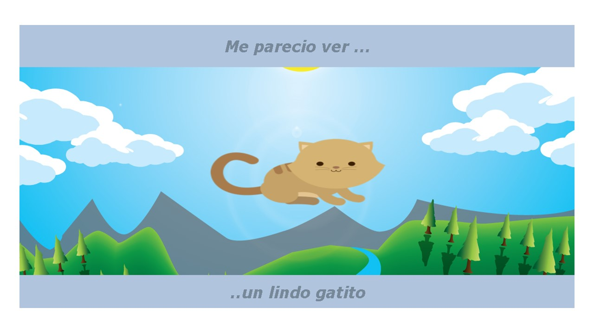
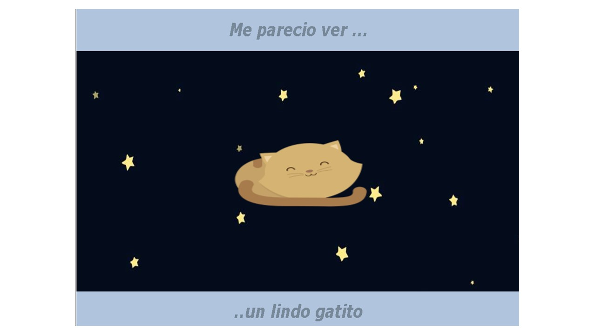
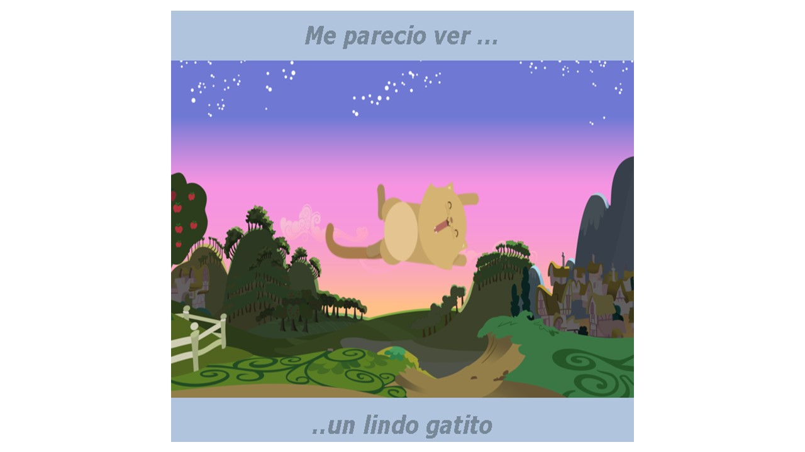

# Proyecto:Kitten
_____________

## Descripción del proyecto
El siguiente proyecto es una página web la cual cambia de fondo e imagen según el tamaño de los pixeles de los dispositivos en que se visualicen.
La propuesta está estructurada con un diseño de grillas de 12 columnas en CSS para que se encuentre bajo los lineamientos del responsive design y sea adapatable a cada dispositivo en que se realice.
## Vistas desktop/tablets
Estas son las vistas para dispositivos con resoluciones mayores o iguales a 768px.

## Vistas mobile
Estas son las vistas para dispositivos con resoluciones menores a 768px.

## Detalles adicionales
-Para esta aplicación se empleó : HTML5, CSS3 y Javascript.

  
  Cualquier consulta, duda o sugerencia puede realizarla al correo: adayc@hotmail.com
